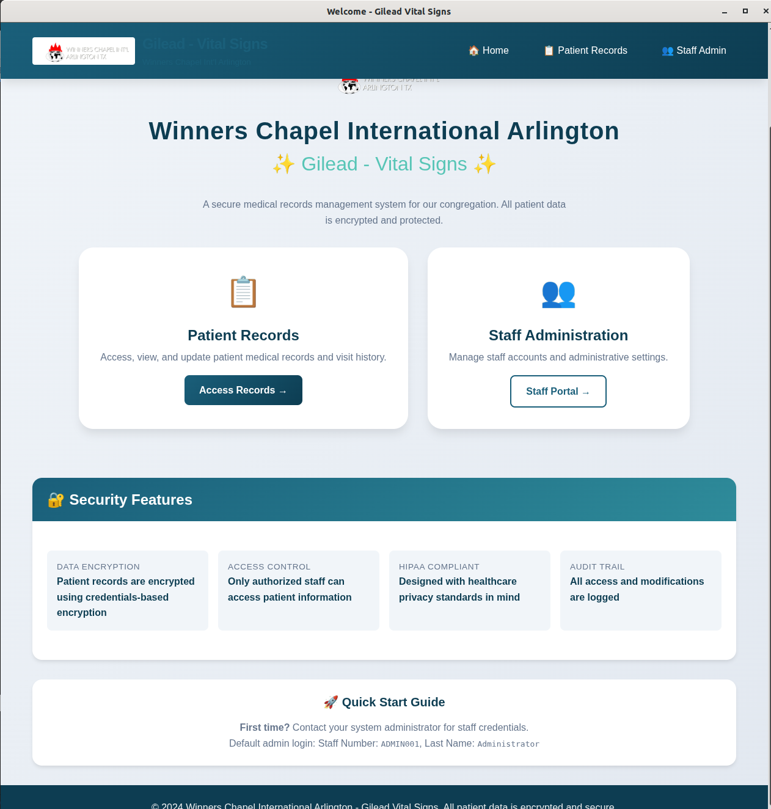
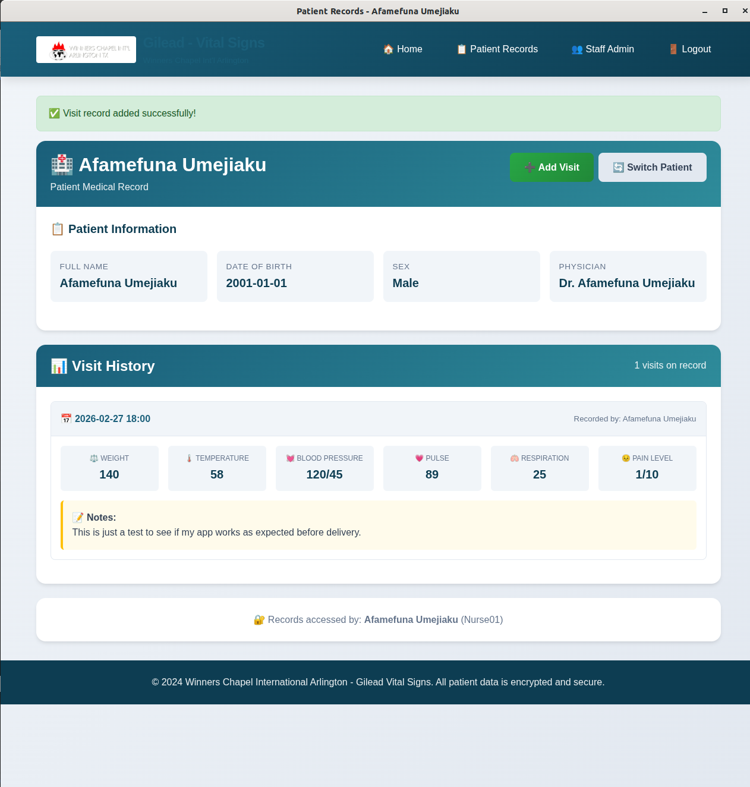
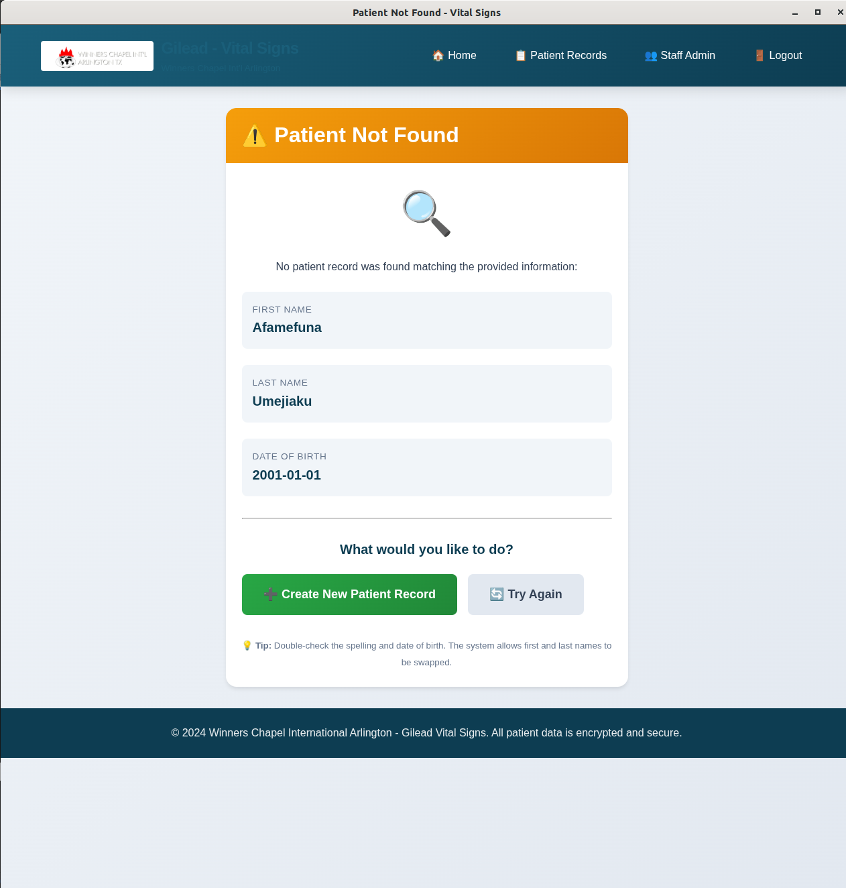
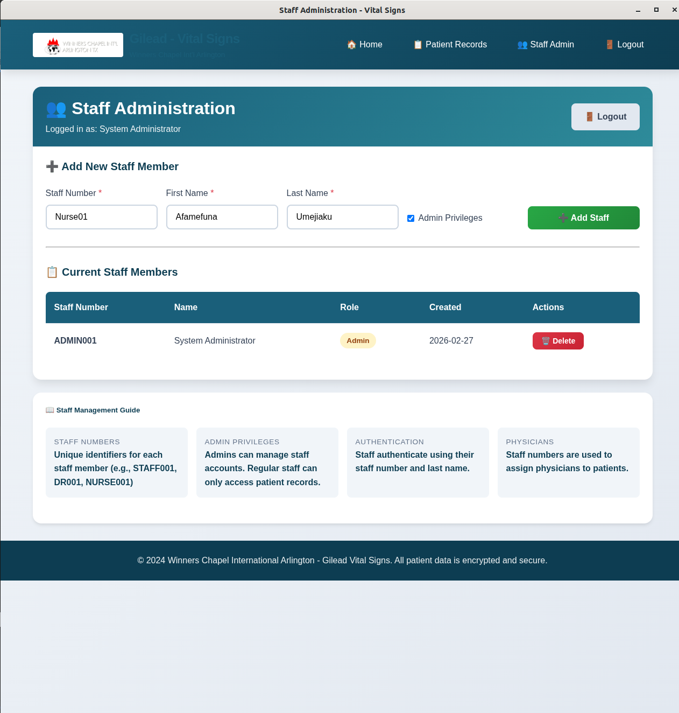

# 🏥 Gilead Vital Signs  
### Secure Medical Records Web Application

A secure, privacy-focused medical records web application built for **Winners Chapel International Arlington – Gilead Health Ministry**.  
The system enables encrypted patient record management, visit documentation, and controlled staff access — designed for real-world church health department workflows.

---

## 📸 Application Preview

<p align="center">
  
</p>

---

## 📋 Table of Contents

- [Features](#-features)
- [Screenshots](#-screenshots)
- [Installation](#-installation)
- [Quick Start](#-quick-start)
- [User Guide](#-user-guide)
- [Security & Encryption](#-security--encryption)
- [Database Schema](#-database-schema)
- [File Structure](#-file-structure)
- [Desktop / Offline Use](#-desktop--offline-use)
- [Production Deployment](#-production-deployment)
- [Troubleshooting](#-troubleshooting)
- [License](#-license)

---

## ✨ Features

### 🏠 Welcome Page
- Church branding and Gilead Vital Signs identity
- Secure navigation to Patient Records and Staff Administration
- Clean, user-friendly interface for non-technical users

### 🧑‍⚕️ Patient Records Management
- Dual authentication: **Staff credentials + Patient identity**
- First/Last name swap tolerance
- Secure new patient registration
- Graceful “Patient Not Found” handling with guided actions

### 🩺 Visit Documentation
Each visit securely records:

| Vital Sign | Description |
|-----------|------------|
| Weight | Patient weight |
| Temperature | Body temperature |
| Blood Pressure | Systolic / Diastolic |
| Pulse | Heart rate |
| Respiration | Breathing rate |
| Pain Level | 0–10 scale |
| Notes | Clinical observations |

### 👥 Staff Administration
- Admin-only staff management portal
- Unique staff numbers (e.g., `ADMIN001`, `NURSE001`)
- Role-based access control
- Secure staff deletion and privilege assignment

### 🔐 Data Security
- Patient records encrypted using patient credentials
- PBKDF2 key derivation
- Encrypted database storage
- Full audit trail of record access

---

## 🖼️ Screenshots

### Welcome Page


### Patient Records & Visit History


### Patient Not Found Handling


### Staff Administration


---

## 🔧 Installation

### Prerequisites
- Python 3.8+
- pip
- Modern web browser

### Setup

```bash
git clone https://github.com/your-username/gilead-vital-signs.git
cd gilead-vital-signs
python -m venv venv
source venv/bin/activate  # macOS/Linux
# or venv\Scripts\activate on Windows
pip install -r requirements.txt
python app.py

## 📄 License and Acknowledgments
This application is provided for use by Winners Chapel International Arlington - Gilead Health Ministry.
- Built with Flask (Python web framework)
- SQLite database (free, no setup required)
- Cryptography library for secure encryption
- Designed for healthcare privacy and security
- Can also be Installed as Desktop App using the Guide.md Instructions
- Gilead Vital Signs Medical Records System v1.0
- Designed and maintained by Afamefuna Umejiaku
